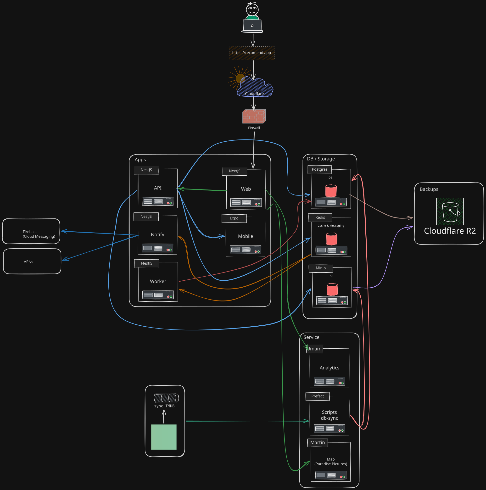
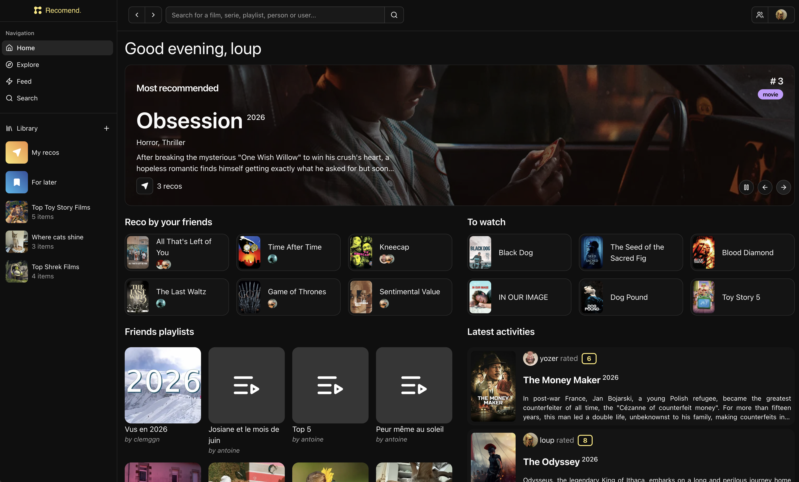

# 🎬 Recomend

<p align="center">
  
</p>

Monorepo of the **Recomend** app, dev by [@lxup](https://github.com/lxup).

[](./LICENSE)

## ✅ TODO

- [ ] Update english translations

## 🚀 Tech Stack

- ⚡️ [Next.js](https://nextjs.org/) – React Framework
- 💳 [RevenueCat](https://www.revenuecat.com/) – Subscriptions
- 📲 [Firebase Cloud Messaging](https://firebase.google.com/docs/cloud-messaging) – Push Notifications
- ☁️ [Cloudflare R2](https://www.cloudflare.com/products/r2/) – Backups
- ⚙️ [Prefect](https://www.prefect.io/) – DB Sync Scripts (with TMDB)
- 🎞️ [TMDB](https://www.themoviedb.org/) – Movie & TV Metadata Provider

<p align="left">
  
</p>

## 📸 Preview



## 📦 Installation

```bash
pnpm install
cp .env.template .env.local
# Add your environment variables to .env.local
pnpm start
```

## 🤝 Contributing

Contributions are welcome! See [CONTRIBUTING.md](./CONTRIBUTING.md) for how to submit issues and pull requests.

## 📄 License

This project is licensed under the [GNU Affero General Public License v3.0](./LICENSE) (AGPL-3.0-or-later).

This means you are free to use, study, modify and share this code, including running a modified version as a network service — but any modified version you distribute or run as a service must also be made available under the same license, with its source code accessible to its users.
